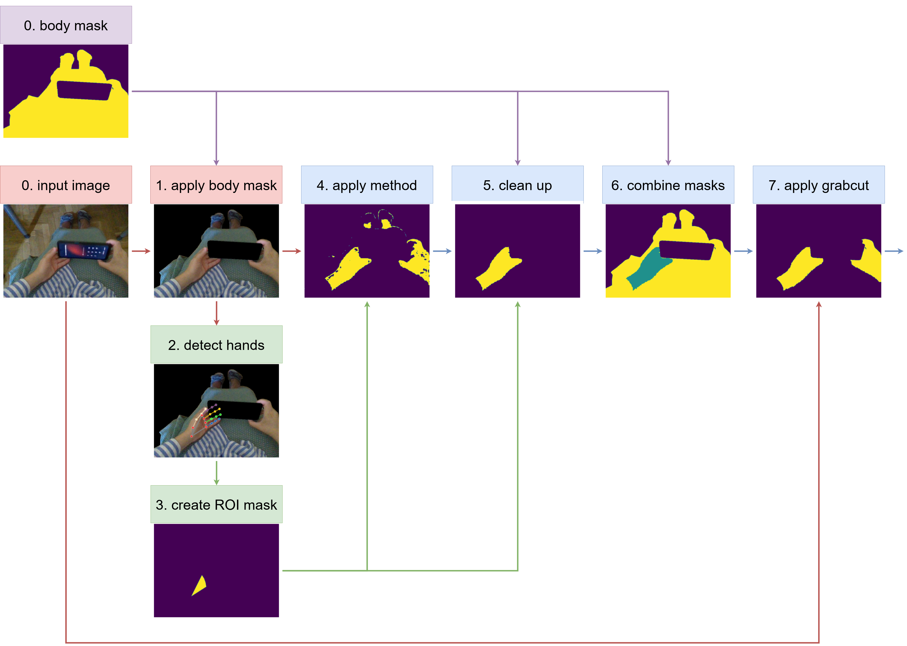

# Automatic Skin Labeling for Egocentric Images for Virtual Reality Applications

Virtual Reality (VR) applications require believable experiences to avoid disorienting users. To achieve this, displaying the user's real body in the virtual environment is a big step forward. However, this can be less believable if the user's clothing does not match the VR environment. To solve this problem, an additional skin class is required in the segmentation step. This paper explores color-based skin segmentation techniques and a deep learning approach to automatically add skin labels to a dataset of egocentric images with body labels. The union of Otsu's method and a histogram-based approach on the HCrCb color space are shown to be effective in a proposed end-to-end system that shows promise as a solution to this problem. A deep learning approach also achieves exceptional performance, although the credibility of it's results is questioned due to a high similarity of the images in the dataset. Future work can improve the robustness and generalizability of the proposed system, and perform a more rigorous evaluation of deep learning approaches.

Note: The models and data are not included due to copyright restrictions with Siemens.

## Documentation

More information can be found in the paper at `paper.pdf`.

## Pipeline

## Examples

